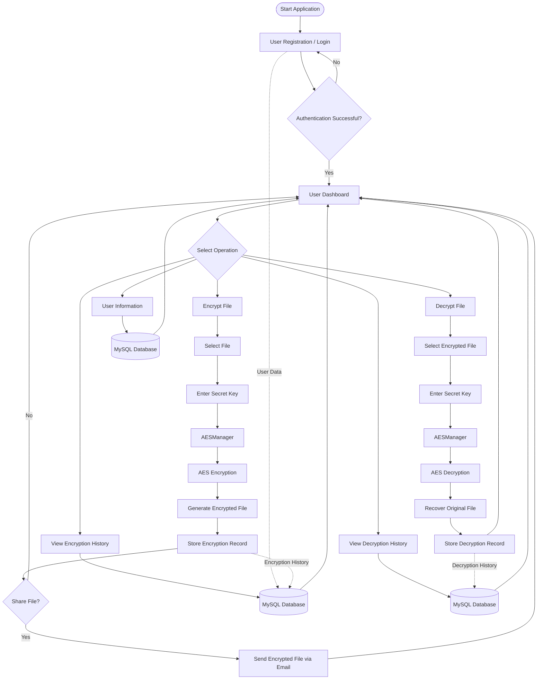
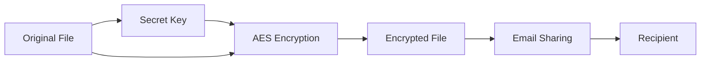
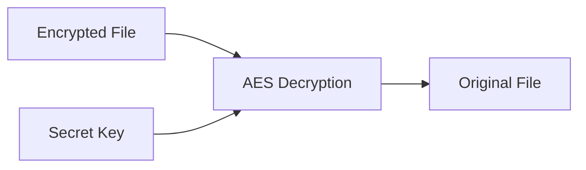

# 🔐 Advance Encryption Using AES

A Java-based secure file management and file-sharing application that uses the **Advanced Encryption Standard (AES)** cryptographic algorithm to protect files before they are shared. The system combines AES-based encryption and decryption, user authentication, database management, file handling, and email-based file transfer to provide an additional layer of privacy for sensitive files.

---

## 📌 Project Overview

**Advance Encryption Using AES** is a desktop security application developed using **Java, Java Swing, MySQL, JDBC, and AES cryptography**.

The primary objective of the project is to protect files before they are transmitted through email or other communication channels. Instead of sending the original file directly, the application encrypts the file using AES and generates an encrypted version that can be shared with the intended recipient.

The recipient requires the appropriate secret key to decrypt the encrypted file and recover the original content.

The application also provides user registration and authentication, database connectivity, encryption/decryption history, and a graphical interface for managing the complete process.

---

## 🎯 Objectives

- Implement AES-based file encryption and decryption.
- Provide an additional privacy layer for files shared through email.
- Prevent direct access to the original file without the required secret key.
- Provide a graphical interface for encryption and decryption operations.
- Maintain user information through a database.
- Record encryption and decryption activities.
- Demonstrate the practical application of cryptography in a file-sharing system.

---

## ✨ Key Features

- 🔐 **AES File Encryption**
- 🔓 **AES File Decryption**
- 📁 **File-Based Encryption and Decryption**
- 📧 **Encrypted File Sharing through Email**
- 🔑 **Secret-Key Based File Access**
- 👤 **User Registration**
- 🔐 **User Authentication**
- 🗄️ **MySQL Database Integration**
- 📜 **Encryption History**
- 📜 **Decryption History**
- 🖥️ **Java Swing GUI**
- ✅ **Input Validation**
- 📂 **File Management**
- 🛡️ **Additional Privacy Layer for Shared Files**

---

## 🔄 Application Workflow

The application follows a secure file-processing workflow integrating user authentication, AES encryption/decryption, database operations, and encrypted file sharing.



### 🔐 Encryption Flow



### 🔓 Decryption Flow



### 🗄️ Data Management

User information and encryption/decryption activity are maintained through the MySQL database. The application uses JDBC to communicate between the Java application and the database.

```text
Java Swing GUI
       │
       ▼
Application Logic
       │
       ├──────────────► AES Module
       │                    │
       │                    ├── Encryption
       │                    └── Decryption
       │
       ├──────────────► Database Layer
       │                    │
       │                    └── MySQL
       │
       └──────────────► Email Module
                            │
                            └── Encrypted File Transfer
```
